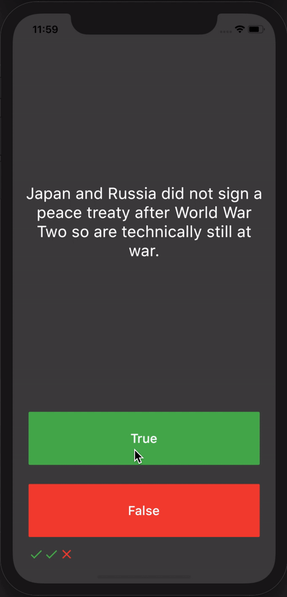

# Quizzler
A simple quiz app built using Flutter Framework. It covers the fundamental building blocks of Object Oriented Programming (OOP).

## Content
- [X] Use Modular Approach: Separate classes
- [X] Use OOP Concepts: Encapsulation, Data Abstraction, Polymorphism and Inheritance
- [X] Use Dart Modifiers: private and public
- [X] Use Dart Lists

## Package
- [X] [rflutter_alert](https://pub.dev/packages/rflutter_alert)

## Credits
Learned the basics of flutter from [App Brewery](https://www.appbrewery.co/).
